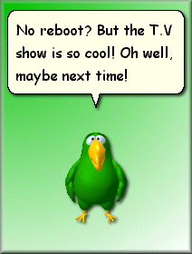

## Microsoft Agent Voice Input Sample

### Description

A great example of Microsoft Agent speach programming! Peedy can launch websites (like EbaY and Planet Source Code; open menus; give the time and date; shutdown/reboot your computer and much more!

The files you'll need can be downloaded from

http://msdn.microsoft.com/workshop/imedi

a/agent/agentdl.asp.

You'll need the Microsoft Agent Core

Components, L&H Text to speach, the Peedy character, and the Microsoft Speach Recognition Engine
 
### More Info
 

             |
---                |---
**Submitted On**   |2000-02-21 23:42:28
**By**             |[Brian](https://github.com/Planet-Source-Code/PSCIndex/blob/master/ByAuthor/brian.md)
**Level**          |Beginner
**User Rating**    |4.0 (16 globes from 4 users)
**Compatibility**  |VB 5\.0, VB 6\.0, VB Script
**Category**       |[Complete Applications](https://github.com/Planet-Source-Code/PSCIndex/blob/master/ByCategory/complete-applications__1-27.md)
**World**          |[Visual Basic](https://github.com/Planet-Source-Code/PSCIndex/blob/master/ByWorld/visual-basic.md)
**Archive File**   |[CODE\_UPLOAD35552222000\.zip](https://github.com/Planet-Source-Code/brian-microsoft-agent-voice-input-sample__1-6208/archive/master.zip)

